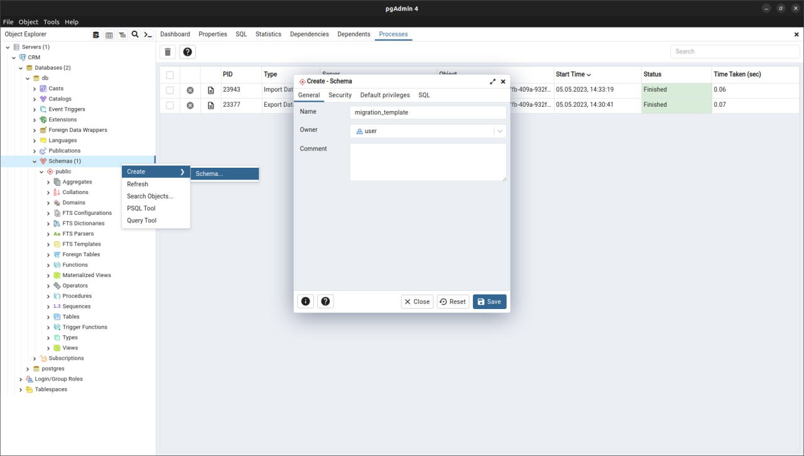
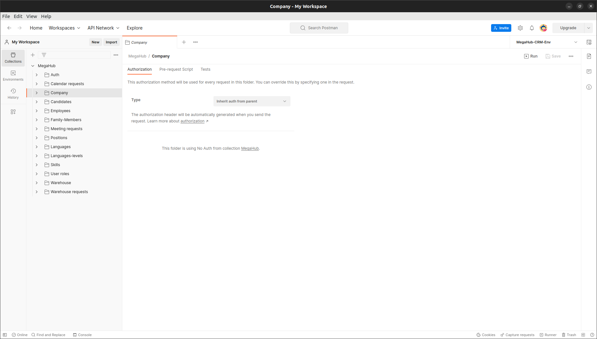
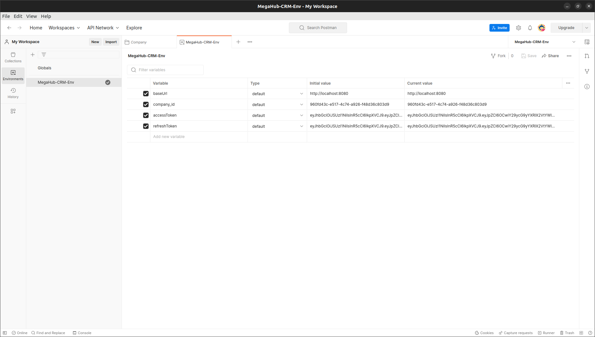
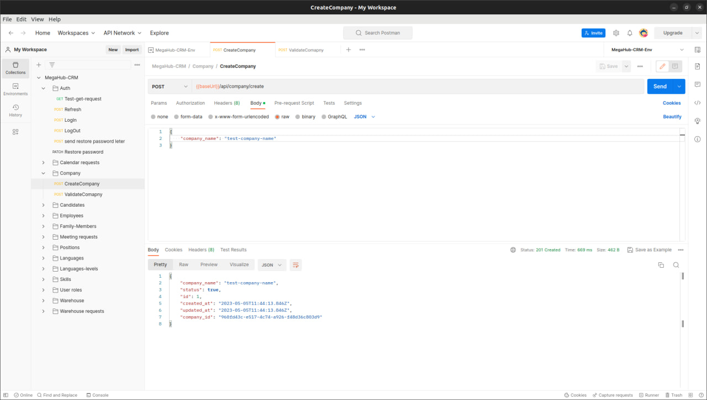
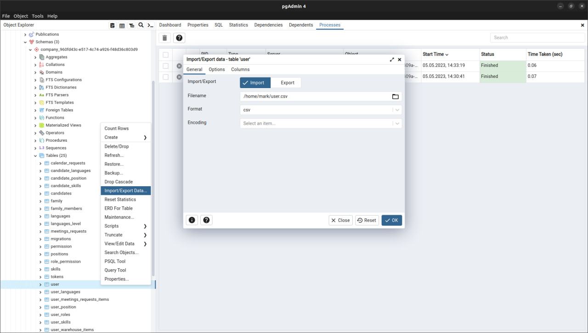
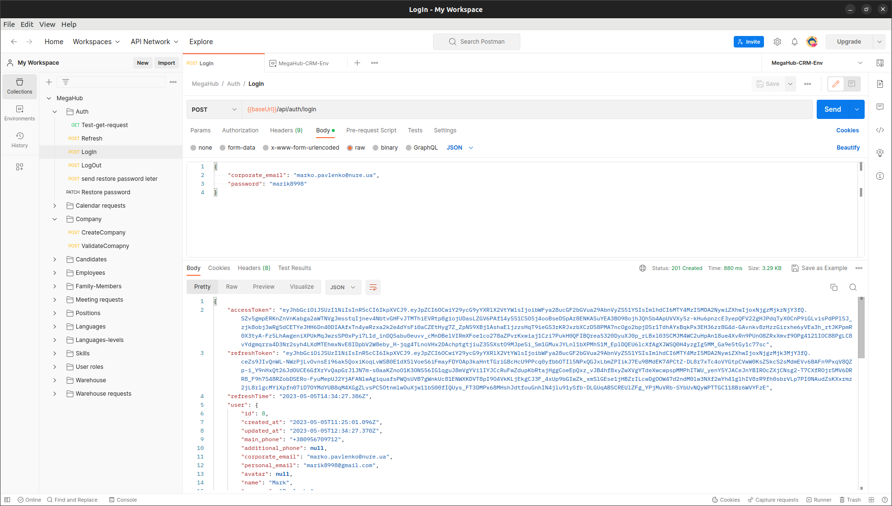

🔥 **Configuring backend manual**
---

## ⚡ **Installation**

-  Install all necessary app packages and dependencies `yarn install`

- Rename `.env.example` file just to `.env` (all necessary data is already inserted)

- Create docker container with pre-configured PostgreSQL DB inside `docker compose up`

-  Run migrations for super-admin panel backend app part (API functionality not completed) - 
- `yarn typeorm:run-migrations-public`

- Create in db directory new schema with name `migration_template`
  

- Add migration data to create correct DB tables schemas every time, when new company is being added `yarn typeorm:run-migrations-company`

- Import Postman API Data Collection and Environment from `/postman` directory in root of project

- Start the local server with command `yarn backend-dashboard:start` (start at port `8080` by default)

- Create new company using the POST api: `http://localhost:8080/api/company/create`. Get it `company_id` value and insert to the Postman environment field value with the same name 

- Take `user.csv` file from `/dumps` directory and import it to the automatic created database with the same id, as company has.
- A new user with superadmin rights will be created 

- Try to log in to the app. If everything will be fine, you will see sign in data.

- Get `accessToken` and `refreshToken` values and insert them to the `environment fields` in order to get access to the API (in other case, will get `401` error)
---

## 🚀 **Usage**

- A CRM is completed REST API system. It allows companies to create own databases with environments in order to create personal list of employees to manage them. 
- Implemented create company mechanism in order to manipulate them from general company domain (super-admin functionality not completely implemented)
- Implemented validation company mechanism and sign in to specific database
- Implemented forgot / reset password functionalities with sending special messages to the e-mail using hashing key system and Nodemailer
- Implement auth, check on user authorization API data access token validation, automatic updating access token if refresh token is valid and logout, if both of them are expired
- Implementing CRUD API`s for employees, candidates, calendar requests, etc (watch PostMan API for more detailed info)
- Implementing data pagination mechanism with pages, limit and order query params

---

## 🌲 **Project tree**

- `/apps/backend/dashboard` - folder with backend app part
- `/apps/frontend/dashboard` - folder with fronted app part
- `/apps/e2e/dashboard` - folder with Unit-tests for the frontend (backend tests are located in backend folder)

Backend implemented using Nest.js framework with TypeORM

---

## 📝 **Additional notes**

- <!-- ... [ADD ADDITIONAL NOTES] -->

---

## 📸 **Screenshots**

<!-- ... [SOME DESCRIPTIVE IMAGES] -->
